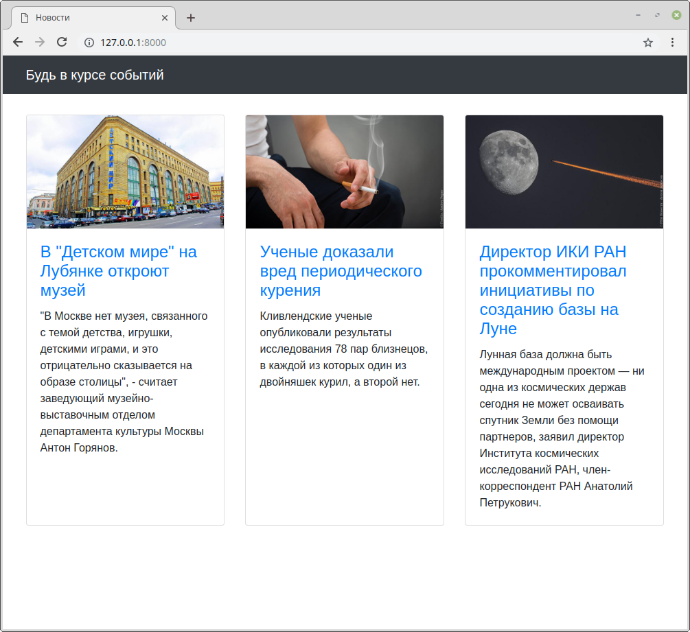
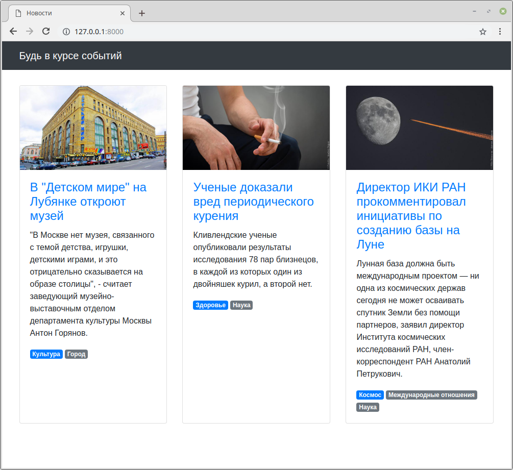

## Задание

Есть небольшой новостной сайт.



Было решено к статьям добавить тематические резделы, к которым они относятся, и отображать их у каждой новости в виде списка тегов.



У каждой статьи может быть несколько разделов, но всегда один из них должен быть основным.
В списке тегов он должен идти первым, потом все остальные в алфавитном порядке.

В админке необходимо реализовать создание разделов
и для страницы _Редактирование статьи_ добавить возможность указывать разделы.
Необходимо так же реализовать проверку на наличие одного и только одного основного раздела.


## Примечание

* `Tag` - просто тег, только его название, ничего более.
* `Article` - статья с текстом, заголовком, картинкой и пр. + набор тегов (многие ко многим)
* `Scope` - таблица связка между статьей и тегом. Именно здесь должно быть свойство `is_main`

---

Вам не надо менять шаблон! Ваша задача реализовать модели и логику так, чтобы текущий шаблон заработал (используйте `related_name`). Для этого внимательно посмотрите на добавленные строки для тегов:

```django

    <span class="badge badge-primarybadge-secondary">{{ scope.tag.name }}</span>

```

Для запуска проекта необходимо:

Установить зависимости:

```bash
pip install -r requirements.txt
```

Провести миграцию:

```bash
python manage.py migrate
```

Загрузить тестовые данные:

```bash
python manage.py loaddata articles.json
```

Запустить отладочный веб-сервер проекта:

```bash
python manage.py runserver
```
